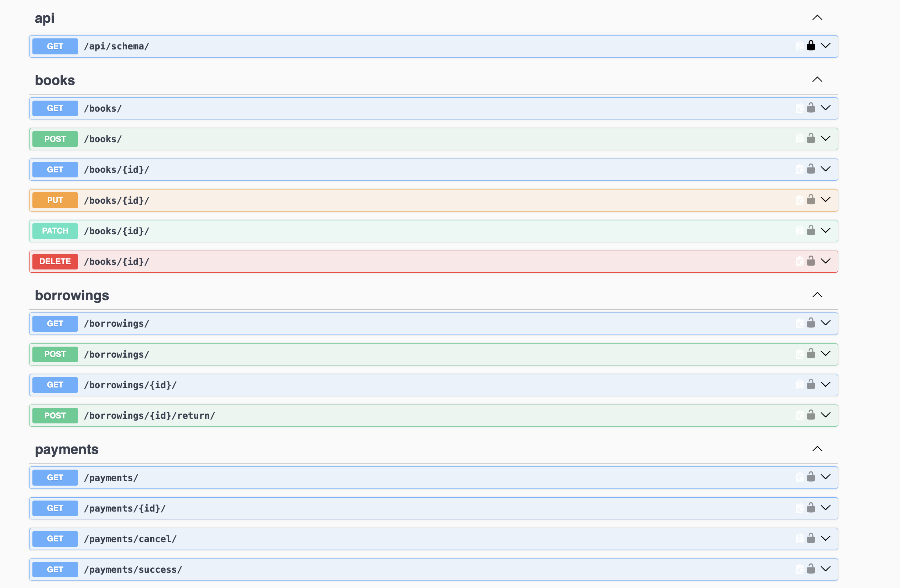

# Library Service API

A backend system for managing book borrowings at a library. It tracks book inventory, manages user borrowings, handles payments through Stripe, and sends real-time notifications to a Telegram chat.

## 🚀 Features

- **Book Management** — full CRUD for administrators (title, author, cover type, inventory, daily fee); read-only access for everyone else.
- **Borrowing System** — users create borrowings, which automatically decrease the book's inventory by one and create a Stripe payment session.
- **Return Logic** — a custom `return` action restores the book's inventory and prevents a borrowing from being returned twice.
- **Payments (Stripe)** — a checkout session is created automatically for every new borrowing; `success`/`cancel` endpoints confirm the payment outcome.
- **Telegram Notifications** — a message is sent to a Telegram chat whenever a new borrowing is created, and daily for overdue borrowings.
- **Scheduled Task (Celery)** — a daily job checks for overdue borrowings and notifies the Telegram chat about each one (or confirms none are overdue).
- **Authentication & Security** — JWT-based auth (`djangorestframework-simplejwt`); secrets kept out of git via `python-dotenv` and `.env`.
- **Filtering** — borrowings can be filtered by `is_active` and, for admins, by `user_id`.
- **API Documentation** — interactive Swagger UI via `drf-spectacular`.

## 🛠 Tech Stack

- Python 3.11, Django 5, Django REST Framework
- SQLite (local development database)
- Celery + Redis (scheduled background tasks)
- Stripe API (payments)
- Telegram Bot API (notifications)

## ⚡️ Quick Start (local)

This project runs locally with a virtual environment — there is no Docker setup.

```bash
git clone <repo_url>
cd library-service-api
python3 -m venv venv
source venv/bin/activate
pip install -r requirements.txt
```

### Environment variables

Copy `.env.sample` to `.env` and fill in real values:

```
SECRET_KEY=
DEBUG=True
STRIPE_SECRET_KEY=
TELEGRAM_BOT_TOKEN=
TELEGRAM_CHAT_ID=
CELERY_BROKER_URL=redis://localhost:6379/0
```

- `STRIPE_SECRET_KEY` — a **test** secret key from [dashboard.stripe.com](https://dashboard.stripe.com) (Sandbox/Test mode)
- `TELEGRAM_BOT_TOKEN` — a bot token created via [@BotFather](https://t.me/BotFather)
- `TELEGRAM_CHAT_ID` — the chat id the bot should post notifications to

### Database

```bash
python manage.py migrate
python manage.py createsuperuser
```

### Redis (required for Celery)

```bash
brew install redis
brew services start redis
```

## ▶️ Running the project

Three processes need to run at the same time, each in its own terminal:

```bash
python manage.py runserver
```
```bash
celery -A config worker --loglevel=info
```
```bash
celery -A config beat --loglevel=info
```

The API is available at `http://127.0.0.1:8000/`.

## 📖 API Documentation

Interactive Swagger UI: `http://127.0.0.1:8000/api/docs/`
ReDoc: `http://127.0.0.1:8000/api/redoc/`



## 🔗 Main Endpoints

| Method | Path | Description |
|---|---|---|
| POST | `/users/` | Register a new user |
| POST | `/users/token/` | Obtain JWT (email + password) |
| POST | `/users/token/refresh/` | Refresh access token |
| GET/PUT/PATCH | `/users/me/` | Current user's profile |
| GET/POST | `/books/` | List books / create (admin only) |
| GET/PUT/PATCH/DELETE | `/books/<id>/` | Book detail / update / delete (admin only) |
| GET/POST | `/borrowings/` | List borrowings (filters: `is_active`, `user_id`) / create |
| GET | `/borrowings/<id>/` | Borrowing detail |
| POST | `/borrowings/<id>/return/` | Return a borrowed book |
| GET | `/payments/` | List payments (own for regular users, all for admins) |
| GET | `/payments/<id>/` | Payment detail |
| GET | `/payments/success/` | Confirm a successful Stripe payment |
| GET | `/payments/cancel/` | Notify that payment was cancelled |

## 🔒 Permissions

- Anonymous users: can only list/view books
- Authenticated users: can create/view their own borrowings and payments
- Admins (`is_staff`): full access to books, can see all borrowings/payments, can filter by `user_id`

## 🤖 Example Telegram Notification

When a user creates a borrowing via `POST /borrowings/`, the bot immediately sends a message like:

```
New borrowing created!
Book: 1984
User: user@example.com
Expected return: 2026-09-15
```

## 💳 Testing Payments

Stripe runs in **test mode** — no real money is involved. Use the test card `4242 4242 4242 4242`, any future expiry date, and any CVC to complete a payment.

## ✅ Tests

```bash
python manage.py test
```

Custom code coverage: **97%** (measured with `coverage`).

## Known Limitations

- Runs locally (venv), no `docker-compose` setup
- Uses SQLite rather than PostgreSQL
